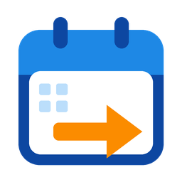

# Calendar Relay for Home Assistant



[](https://hacs.xyz/)
[](https://opensource.org/licenses/MIT)

Calendar Relay pushes events from Home Assistant calendar entities into a CalDAV calendar (iCloud,
Nextcloud, Radicale and other CalDAV servers) and keeps them in step. It works one way and without churn:
an event is only written when it is new or has changed, and it is removed when it no longer belongs.

## Example: football call-ups in the family calendar

The [KampKlar](https://github.com/FrederikLeed/kampklar-ha) integration gives each child a calendar and
marks a match the child is selected for with the title prefix `⭐ Udtaget: `. A parent adds one relay per
child:

| Setting | Value |
|---------|-------|
| Source calendar | Emma's KampKlar calendar |
| Target calendar | Family (the shared iCloud Family calendar) |
| Title filter | `⭐ Udtaget: ` |
| Remove filter text from title | On |
| Title prefix | `⚽ Emma: ` |

The call-up `⭐ Udtaget: Home - Away` now shows in everyone's Family calendar as `⚽ Emma: Home - Away`.
Training sessions and matches Emma is not selected for stay out. When the match is rescheduled, the entry
moves. When the call-up is withdrawn, the source title loses the `⭐ Udtaget: ` prefix, no longer matches
the filter, and the entry disappears from the Family calendar.

## Installation

### HACS

1. Open HACS, then the three-dot menu > **Custom repositories**.
2. Add `https://github.com/FrederikLeed/ha-calendar-relay` with the category **Integration**.
3. Install **Calendar Relay** and restart Home Assistant.

### Manual

Copy `custom_components/calendar_relay/` into your `config/custom_components/` directory and restart.

Home Assistant 2026.3.0 or newer is required.

## Setup

### 1. Add a CalDAV account

**Settings** > **Devices & services** > **Add integration** > **Calendar Relay**, then enter the server
URL, username and password. The integration signs in and lists your calendars to check the details. Each
account is one entry; add as many as you need.

#### iCloud

iCloud does not accept your normal Apple Account password from other apps. Use an app-specific password:

1. Make sure two-factor authentication is on for your Apple Account.
2. Sign in at [appleid.apple.com](https://appleid.apple.com), open **Sign-In and Security** and choose
   **App-Specific Passwords**.
3. Create a password and give it a name you will recognise, such as "Home Assistant". It looks like
   `abcd-efgh-ijkl-mnop`.
4. In Calendar Relay, keep the server URL `https://caldav.icloud.com/`, enter your Apple Account email
   address as the username and the app-specific password as the password.

Changing your Apple Account password revokes all app-specific passwords. Home Assistant then asks you to
reauthenticate; create a new app-specific password and enter it there.

#### Other servers

Use the address your server documents for CalDAV clients, for example
`https://cloud.example.com/remote.php/dav` for Nextcloud or `http://radicale.local:5232/` for Radicale.
The root of a server that supports `/.well-known/caldav` also works.

### 2. Add a relay

Open the account entry and choose **Add relay**:

| Field | Meaning |
|-------|---------|
| Source calendar | Any calendar entity in Home Assistant. |
| Target calendar | A calendar on the account. Only calendars that accept events, and that you may write to when the server says so, are offered. Reminders lists are left out. |
| Title filter | Only events whose title contains this text are relayed. Case does not matter. Empty relays everything. |
| Remove filter text from title | Removes the filter text from the relayed title, plus separators such as `:` and spaces left in front. |
| Title prefix | Put in front of every relayed title. Include the trailing space you want. |
| Look-ahead | How many days ahead to relay, 1 to 365 (default 60). |

A relay can be changed later with **Reconfigure** on the relay. Each relay gets a device with two entities:

- **Sync now** button: runs a sync right away.
- **Last sync** sensor (diagnostic): the time of the last sync that finished without errors, with the
  attributes `relayed_events` (how many relayed events are tracked) and `last_error` (text, or empty).

## How it works

- **When**: a relay syncs once Home Assistant has started, about 30 seconds after the source calendar's
  state or attributes change, every 15 minutes, and when you press **Sync now**. Only one sync runs per
  relay at a time.
- **What is read**: events that have not ended yet, up to the look-ahead. The relay calls the calendar
  entity directly, because the `calendar.get_events` action leaves out the event's unique id.
- **Identity**: a source event is identified by its uid (plus its recurrence id for a recurring event).
  Each relayed event gets its own resource `relay-<id>.ics` and UID `<id>@calendar-relay`, so a changed
  event is replaced in place.
- **What is written**: the title (filtered and prefixed), start and end, description and location.
  Timed events are written in UTC, all-day events as dates. No alarms, organizer or attendees are written,
  so nobody gets an invitation.
- **Sync state**: what was written where is kept in Home Assistant's storage
  (`.storage/calendar_relay.<relay id>`), so nothing is rewritten after a restart.
- **Safety**: if the source calendar is missing, unavailable or fails to read, the sync is skipped and
  nothing is deleted. If a source that is available suddenly returns no events at all, relayed events are
  only removed when a sync at least 10 minutes later still sees nothing, so a source that briefly returns
  an empty list does not empty the target calendar. A write or delete only ever targets an `.ics` resource
  inside the calendar it was written to, also when the server redirects the request.
- **Start-up**: nothing syncs until Home Assistant has started, because source calendars often report a
  state before their data is loaded.

## Errors and repairs

- The server answers 401, or 403 without a reason: Home Assistant asks you to reauthenticate the account.
- The target calendar is gone (404, or 409 without a reason, when writing), or it answers 403 and is not a
  calendar of this account (for example after the account was reconfigured to another user): a repair
  issue names the relay. Reconfigure the relay or restore the calendar; the issue disappears after the next
  successful sync.
- The server refuses one event with a reason (403 or 409 with a CalDAV precondition, such as a UID that
  already exists in another calendar): only that event fails, the rest of the sync goes on, and the next
  sync tries it again.
- Anything else (timeouts, rate limits, server errors): a warning in the log, and the next sync tries again.

## Limits

- One way only. Changes made to a relayed event in the target calendar are kept until the source event
  changes, then overwritten.
- An event you delete by hand from the target calendar is not recreated unless its source event changes.
- A withdrawn event is deleted only if it has not started yet. Running and past events stay in the target
  calendar.
- Removing a relay, or the whole account, leaves its events in the target calendar. To remove them first,
  set the relay's title filter to text that matches nothing, press **Sync now**, then remove the relay.
  Events that have already started stay.
- Changing a relay's target calendar moves its future events: they are deleted from the old calendar and
  written to the new one. If the new calendar refuses an event, it is put back into the old calendar and
  stays there until it changes or Home Assistant restarts. Copies the relay can no longer reach (a server
  address or account that changed) stay in the old calendar.
- Recurring events are relayed as separate single events, one per occurrence inside the look-ahead.
- Source events without a uid are identified by title and start time, so moving or renaming one shows up
  as a delete and a new event. Once the event has started the old copy is kept, so a running event moved
  or renamed then shows up twice until the old copy ends.
- A bare 403 from the account's own calendars is taken as a permission problem and starts
  reauthentication, even when the real cause is something a new password cannot fix.
- iCloud limits CalDAV traffic without publishing the limits. Relays only write changes, but many relays
  with long look-aheads still mean more requests.
- Tested against Radicale in the test suite and against a live iCloud account (create, unchanged resync
  and delete of an event, with the shared Family calendar offered as a target).

## Troubleshooting

**Settings** > **Devices & services** > **Calendar Relay** > three-dot menu > **Download diagnostics**
gives a file you can attach to an issue. The integration's part contains counts and states only: no
username, password, server or calendar addresses, entity ids or titles. Home Assistant also adds any open
repair issues to the file, and a "target calendar missing" issue names the relay, so check the file before
you share it if a relay is named after a person.

## Development

```bash
python3.14 -m venv .venv
.venv/bin/pip install -r requirements_test.txt ruff==0.16.7
.venv/bin/python -m pytest --cov=custom_components.calendar_relay --cov-report=term-missing
.venv/bin/ruff check . && .venv/bin/ruff format --check .
```

The tests include an end-to-end test that starts a real Radicale server on a free local port and relays
events from Home Assistant's local calendar into it.

## License

MIT
